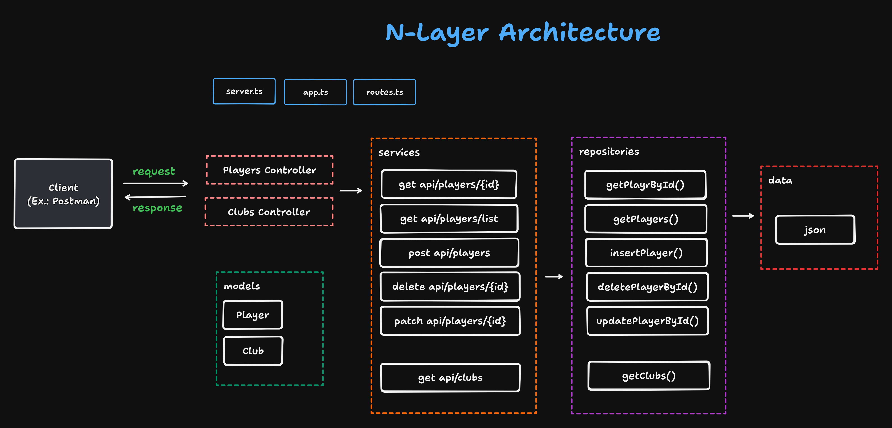

## Arquitetura

- ## Tecnologias Utilizadas
- TypeScript: Linguagem de programação utilizada para o desenvolvimento do projeto.
- Tsup: Ferramenta de construção e empacotamento para projetos TypeScript.
- Tsx: Compilador TypeScript que suporta a construção de projetos.
- Node.js: Ambiente de execução JavaScript que permite executar código JavaScript do lado do servidor.
- @types/node: Pacote de definições de tipos para Node.js para auxiliar no desenvolvimento com TypeScript.
- @types/express: : Pacote de definições de tipos para Node.js

## Licença
Este projeto está licenciado sob a MIT License.

## Contact me

## Some Skills

